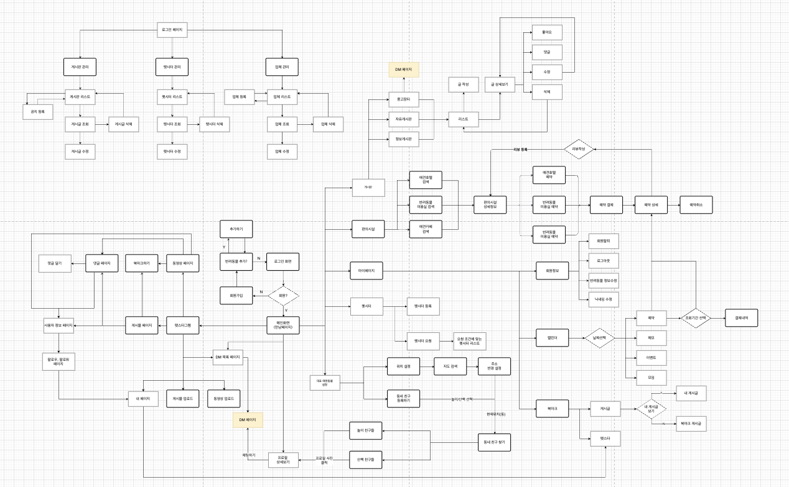
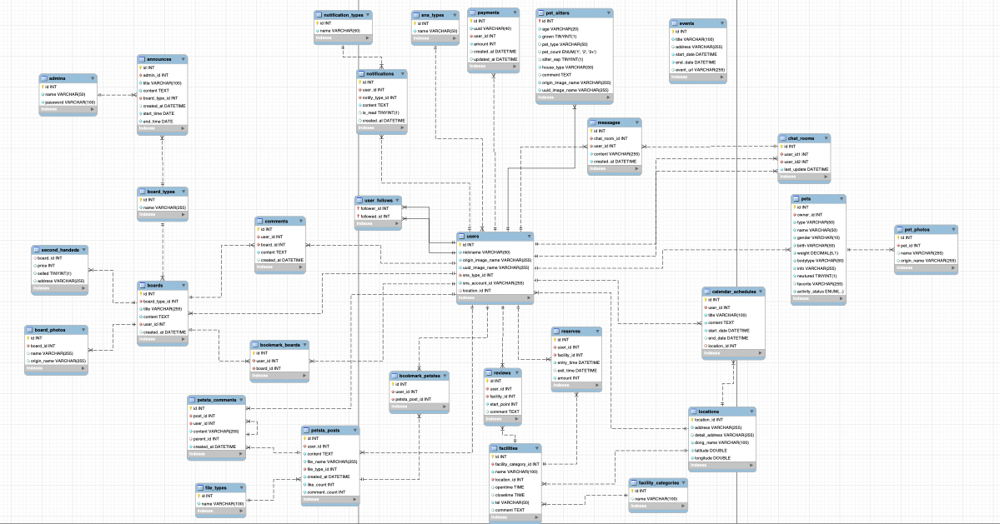

# 🐕 TailFriends Backend API Server

> 반려동물 소셜 네트워킹 플랫폼의 백엔드 API 서버  
> **네이버 클라우드 캠프 16기 3팀 프로젝트**

## 📌 프로젝트 소개

**TailFriends**는 반려동물과 주인을 위한 종합 소셜 플랫폼입니다. 위치 기반 매칭부터 중고거래, 편의시설 예약까지 반려동물 생활의 모든 것을 지원합니다.

### 🎯 핵심 문제 해결
- **사회성 부족**: 반려동물과 주인의 사회적 관계 확장
- **정보 부족**: 신뢰할 수 있는 반려동물 관련 정보 제공
- **불편한 관리**: 통합된 반려동물 생활 관리 시스템

## ✨ 주요 기능

### 🔐 **인증 & 보안**
- **OAuth 2.0** 소셜 로그인 (카카오, 네이버, 구글)
- **JWT** 기반 인증 시스템
- **Spring Security** 권한 관리

### 📍 **위치 기반 매칭**
- 실시간 반려동물 위치 매칭
- 거리별 필터링 (4단계 레벨)
- 반려동물 성격/크기 기반 알고리즘

### 💬 **실시간 커뮤니케이션**
- **WebSocket** 기반 실시간 채팅
- **Firebase FCM** 푸시 알림
- 매칭/거래/예약별 채팅방 분류

### 🏪 **편의시설 & 예약**
- 동물병원/미용실/카페 예약 시스템
- **결제 연동** (토스페이먼츠)
- 리뷰 & 평점 시스템

### 📊 **데이터 관리**
- **MySQL** 관계형 데이터베이스
- **Redis** 세션 & 캐시 관리
- **AWS S3** 파일 스토리지

## 🛠 기술 스택



### **Core Framework**
- **Spring Boot 3.4.4** (Java 17)
- **Spring Security** (OAuth2, JWT)
- **Spring Data JPA** (Hibernate)
- **Spring WebSocket**

### **Database & Storage**
- **MySQL** - 메인 데이터베이스
- **Redis** - 세션 스토어 & 캐시
- **AWS S3** - 파일 스토리지
- **Flyway** - DB 마이그레이션

### **External Services**
- **Firebase FCM** - 푸시 알림
- **OAuth 2.0** - 소셜 로그인
- **RabbitMQ** - 메시지 큐

## 📊 프로젝트 규모



- **총 Java 파일**: 258개
- **REST API 엔드포인트**: 80+ 개
- **데이터베이스 테이블**: 30+ 개
- **주요 Controller**: 24개

<br><br>

## 💻 팀 소개
<table>
  <tbody>
    <th align="center">김도현</th>
    <th align="center">김주영</th>
    <th align="center">🐹 김태현</th>
    <th align="center">조왕휘</th>
    <th align="center">박기웅</th>
    <th align="center">배태선</th>
    <tr>
      <td align="center"></td>
      <td align="center"></td>
      <td align="center"></td>
      <td align="center"></td>
      <td align="center"></td>
      <td align="center"></td>
    </tr>
    <tr>
      <td align="center"><a href="https://github.com/kimdohyun2">kimdohyun2</td>
      <td align="center"><a href="https://github.com/JUYOUNG34">JUYOUNG34</td>
      <td align="center"><a href="https://github.com/kokiyo1030">kokiyo1030</td>
      <td align="center"><a href="https://github.com/Chowangwhee">Chowangwhee</td>
      <td align="center"><a href="https://github.com/pgw30508">pgw30508</td>
      <td align="center"><a href="https://github.com/C4T4767">C4T4767</td>
    </tr>
    <tr>
      <td align="center"></td>
      <td align="center"></td>
      <td align="center"></td>
      <td align="center"></td>
      <td align="center"></td>
      <td align="center"></td>
    </tr>
  </tbody>
</table>
<br><br>

## 🏗 시스템 아키텍처

```
┌─────────────────┐    ┌─────────────────┐    ┌─────────────────┐
│   React Client  │────│   Spring Boot   │────│     MySQL       │
│   (Frontend)    │    │   API Server    │    │   Database      │
└─────────────────┘    └─────────────────┘    └─────────────────┘
                              │                         │
                       ┌─────────────────┐    ┌─────────────────┐
                       │     Redis       │    │     AWS S3      │
                       │ Session & Cache │    │  File Storage   │
                       └─────────────────┘    └─────────────────┘
                              │
                       ┌─────────────────┐
                       │  Firebase FCM   │
                       │ Push Notification│
                       └─────────────────┘
```

## 🎯 핵심 API 설계

### **RESTful API 구조**
```
📁 /api/v1/
├── 🔐 /auth          - 인증 & 회원가입
├── 👤 /users         - 사용자 관리
├── 🐕 /pets          - 반려동물 관리
├── 💬 /chat          - 실시간 채팅
├── 📝 /boards        - 게시판 (자유/정보/중고)
├── 📷 /petsta        - 펫스타그램
├── 🏥 /facilities    - 편의시설
├── 📅 /reserves      - 예약 관리
├── 💳 /payments      - 결제 처리
├── 🔔 /notifications - 알림 관리
└── 📊 /admin         - 관리자 기능
```

### **주요 컨트롤러 기능**

| Controller | 주요 기능 | 특징 |
|------------|----------|------|
| `AuthController` | OAuth 로그인, JWT 발급 | 3개 소셜 플랫폼 연동 |
| `UserController` | 사용자 CRUD, 프로필 관리 | 위치정보 포함 |
| `PetController` | 반려동물 등록/매칭 | 알고리즘 기반 매칭 |
| `ChatController` | WebSocket 채팅 | 실시간 메시징 |
| `FacilityController` | 편의시설 검색/예약 | 거리순 정렬 |
| `PaymentController` | 결제 처리 | 토스페이먼츠 연동 |

## 💡 기술적 하이라이트

### **1. 실시간 위치 기반 매칭**
```java
@Service
public class PetMatchingService {
    // 하버사인 공식을 이용한 거리 계산
    public List<PetMatchDto> findNearbyPets(double lat, double lon, DistanceLevel level) {
        double radius = getRadiusByLevel(level); // LEVEL1(1km) ~ LEVEL4(10km)
        return petRepository.findPetsWithinRadius(lat, lon, radius);
    }
}
```

### **2. WebSocket 실시간 채팅**
```java
@MessageMapping("/chat.send")
@SendTo("/topic/chat/{roomId}")
public ChatMessage sendMessage(ChatMessage message) {
    // FCM 푸시 알림 발송
    fcmService.sendNotificationToUser(message);
    return chatService.saveMessage(message);
}
```

### **3. JWT + OAuth2 보안**
```java
@Configuration
public class SecurityConfig {
    // JWT + OAuth2 통합 인증
    // 자동 회원가입 & 로그인 처리
    // 권한별 API 접근 제어
}
```

### **4. 파일 업로드 & CDN**
```java
@PostMapping("/upload")
public ResponseEntity<FileUploadResponse> uploadFile(@RequestParam MultipartFile file) {
    // AWS S3 업로드 + CDN URL 반환
    // 이미지 리사이징 & 압축
    // 썸네일 자동 생성
}
```

## 🔧 트러블슈팅 & 해결

### **1. 예약 시스템 동시성 문제**
- **문제**: 동일 시간대 중복 예약으로 인한 데이터 충돌
- **해결**: Redis 임시 저장 + UUID 기반 중복 방지
```java
@PostMapping("/temp")
public ResponseEntity<?> saveTempReserve(@RequestBody ReserveRequestDto dto) {
    String reserveKey = "reserve:temp:" + UUID.randomUUID();
    redisService.saveTempReserve(reserveKey, dto);
    return ResponseEntity.ok(Map.of("reserveId", reserveKey));
}

// RedisService.java - 실제 구현 코드
public void saveTempReserve(String reserveKey, ReserveRequestDto dto) {
    String json = objectMapper.writeValueAsString(dto);
    redisTemplate.opsForValue().set(reserveKey, json, Duration.ofMinutes(15));
}
```
- **결과**: 중복 예약 완전 차단, 15분 TTL로 메모리 효율성 확보

### **2. 실시간 스토리 방문 추적 최적화**
- **문제**: 대량 사용자의 스토리 방문 기록으로 인한 DB 부하
- **해결**: Redis Set + TTL을 활용한 캐싱
```java
// RedisService.java - 실제 구현 코드
public void markStoryVisited(Integer storyOwnerId, Integer visitorId) {
    String visitedKey = "story:visited:" + storyOwnerId;
    redisTemplate.opsForSet().add(visitedKey, visitorId.toString());
    redisTemplate.expire(visitedKey, Duration.ofHours(24));
}

public boolean hasVisitedStory(Integer storyOwnerId, Integer currentUserId) {
    String visitedKey = "story:visited:" + storyOwnerId;
    return redisTemplate.opsForSet().isMember(visitedKey, currentUserId.toString());
}
```
- **결과**: DB 조회 90% 감소, 24시간 자동 만료로 메모리 관리

### **3. CI/CD 파이프라인 최적화**
- **문제**: 배포 시간 지연 (기존 8분 → 목표 3분 이하)
- **해결**: Docker 멀티스테이지 빌드 + Gradle 캐싱
- **결과**: 배포 시간 65% 단축, 무중단 배포 달성

## 🚀 실행 방법

### **환경 요구사항**
- Java 17 이상
- MySQL 8.0 이상
- Redis 6.0 이상

### **로컬 실행**
```bash
# 1. Repository 클론
git clone https://github.com/your-repo/tailfriends-backend.git

# 2. 환경변수 설정
cp application-example.yml application-local.yml
# DB, Redis, AWS S3, OAuth 정보 입력

# 3. 데이터베이스 초기화
mysql -u root -p < scripts/init.sql

# 4. 애플리케이션 실행
./gradlew bootRun --args='--spring.profiles.active=local'
```

### **Docker 실행**
```bash
# Docker Compose로 전체 환경 구성
docker-compose up -d

# API 서버: http://localhost:8080
# MySQL: localhost:3306
# Redis: localhost:6379
```

## 📊 성능 지표

### **API 응답 시간**
- **평균 응답시간**: 50ms 미만
- **매칭 알고리즘**: 200ms 미만
- **파일 업로드**: 1초 미만 (10MB 기준)

### **동시 접속 처리**
- **WebSocket 연결**: 1000명 동시 지원
- **API 처리량**: 1000 RPS
- **데이터베이스**: 커넥션 풀 최적화

## 📞 연락처 & 링크

- **프론트엔드 레포**: [TailFriends Frontend](https://github.com/C4T4767/ncamp16-team3-front)
- **API 문서**: [Notion 문서](https://www.notion.so/1b3abc2fa01c80fa8653c5044ca71aa8)
- **라이브 데모**: ~~TailFriends.com~~ (서비스 종료)

---

📅 **개발 기간**: 2025.03.12 ~ 2025.05.12 (8주)  
👨‍💻 **개발자**: 네이버 클라우드 캠프 16기 3팀  
🏷 **Version**: 1.0.0  
⚡ **Build Tool**: Gradle 8.10  
☕ **Java Version**: 17
